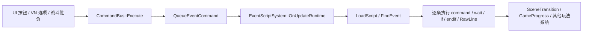
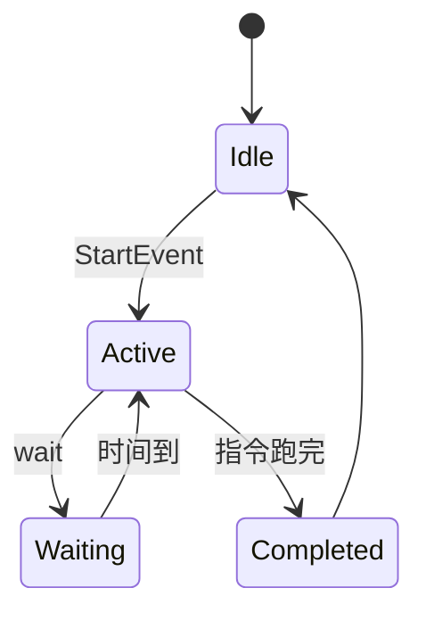

# Part 9.5 · WTS 事件脚本系统：把剧情、按钮、战斗和场景串起来

> 目标：理解 `.wts` 为什么是 Sandbox 的流程骨架。前面的 Part 9 已经讲了
> VN 剧本如何播放一句话、显示选项；后面的 Part 10 会讲横板战斗如何结算胜负。
> `.wts` 正好站在中间：VN 选项、UI 按钮、战斗胜负都只发一个 `event:`，
> 真正的保存、读档、设置旗标、等待和切场景集中写在事件脚本里。

## 9.5.1 为什么需要 .wts

如果没有 `.wts`，每个按钮、VN 选项、战斗组件都要直接写：

```text
progression:set_flag:FLAG_CH01_FAKE_COMBAT_STARTED
scene:assets/scenes/VisualNovelBattle.wt
```

这样很快会出问题：

1. **流程散落**：主菜单、VN、战斗胜利、结算页各写一段跳转逻辑，改主线顺序要到处找。
2. **状态顺序不清楚**：先设置副本、先存档、先等 0.1 秒还是先切场景，很难统一。
3. **编辑器不好维护**：策划看到按钮上写一串底层命令，不如看到 `event:go_side_combat` 清楚。

Sandbox 现在采用的模式是：

```text
UI 按钮 / VN 选择 / 战斗胜负
        ↓
event:<流程名>
        ↓
assets/events/sandbox_flow.wts
        ↓
progression: / gamesave: / wait / scene:
```

也就是说，`.wts` 不是高频脚本语言，而是**低频流程编排语言**。
它适合写"什么时候做什么"，不适合写"每帧怎么动"。

## 9.5.2 三个核心对象

WTS 链路由三个对象组成：

| 对象 | 文件 | 作用 |
| --- | --- | --- |
| `.wts` 资产 | `Projects/WheatearDemo/assets/events/sandbox_flow.wts` | 保存多个 `event` 流程块 |
| `EventScriptComponent` | `Wheatear/src/Wheatear/Scene/Components/ScriptComponents.h` | 场景实体上的脚本绑定 |
| `EventScriptSystem` | `Wheatear/src/Wheatear/Scripting/EventScriptSystem.cpp` | 运行时加载、热重载和执行事件 |

场景里通常会有一个叫 `FlowController` 的实体，例如：

```yaml
TagComponent:
  Tag: FlowController
EventScriptComponent:
  ScriptPath: "assets/events/sandbox_flow.wts"
  StartEvent: "on_start"
  RunOnStart: false
  RunOnce: false
  Enabled: true
```

这里的 `FlowController` 名字只是给人看的。运行时真正读取的是
`EventScriptComponent`，不是 Tag。

再强调一次源码默认值：`Wheatear/src/Wheatear/Scene/Components/ScriptComponents.h`
里 `EventScriptComponent` 的默认值是 `RunOnStart = true`、`RunOnce = true`、
`Enabled = true`。Sandbox 场景资产里的 FlowController 之所以显式写成 `false`，
是因为它们要等按钮、VN 选择或战斗胜负发出 `event:` 才开始跑。

几个字段的含义：

| 字段 | 含义 |
| --- | --- |
| `ScriptPath` | `.wts` 文件路径，按项目资产路径解析 |
| `StartEvent` | 进场自动执行时用的默认事件名 |
| `RunOnStart` | 运行时启动场景时是否自动执行 `StartEvent` |
| `RunOnce` | 这个组件在本次场景实例中跑完一次事件后，是否拒绝再次启动 |
| `Enabled` | 是否启用这个组件 |

Sandbox 的公共 FlowController 都是 `RunOnStart: false`、`RunOnce: false`。
原因很实际：它们主要负责按钮、VN、战斗胜负的流程分发，同一个场景里可能多次
触发不同事件。如果 `RunOnce` 设成 true，第一个事件跑完后，本场景实例里的后续
`event:` 就会被挡掉。

## 9.5.3 .wts 文件长什么样

`sandbox_flow.wts` 的核心片段：

```text
event go_fake_combat:
    progression:set_flag:FLAG_CH01_FAKE_COMBAT_STARTED
    scene:assets/scenes/VisualNovelBattle.wt
end

event fake_combat_victory:
    progression:set_flag:FLAG_CH01_FAKE_COMBAT_CLEARED
    wait 0.10
    scene:assets/scenes/TurnCombat.wt
end

event side_combat_victory:
    if last_dungeon CH02_MAIN_BearAwakening
        progression:set_flag:FLAG_CH02_TUTORIAL_CLEARED
    endif
    wait 0.10
    scene:assets/scenes/Result.wt
end
```

当前解析器在 `EventScript.cpp`，支持这些语法：

| 写法 | 说明 |
| --- | --- |
| `event <name>:` | 定义事件块 |
| `event:<name>` | 顶层兼容写法，也会定义事件块；写在事件内部时是 `event:` 命令 |
| `end` / `endevent` | 结束当前事件块 |
| `wait 0.25` | 等待指定秒数，执行权交回下一帧 |
| `if <condition>` / `endif` | 条件分支，支持嵌套 |
| `command <cmd>` / `cmd <cmd>` | 明确执行一条命令 |
| 直接写命令 | 常用命令可以省略 `command` |
| `# 注释` / `// 注释` | 注释，会被编辑器保留 |

裸命令不是任意字符串。解析器当前直接识别：

```text
quit
scene:
newgame:
loadgame:
progression:
gamesave:
ui:
event:
```





如果要在 `.wts` 里写其它 `CommandBus` 命令，例如 `anim:`、`side:`、`turn:`、
`tactic:` 或将来新增的前缀，建议写成：

```text
command anim:play:@123456789:attack
command side:basic
```

Graph 编辑器保存时也会做同样处理：非白名单命令会自动加 `command` 前缀，
保证下次解析不会被当成未知行。

未知行不会被删除。解析器会把它保存成 `RawLine`，编辑器写回时保留原文；
运行时执行器会跳过它。这是为了让图形编辑器不会破坏手写内容。

## 9.5.4 条件系统

条件判断在 `EventScriptSystem.cpp` 的 `EvaluateCondition` 里，读取的是
`GameProgress::GetState()`。

当前支持：

| 条件 | 含义 |
| --- | --- |
| `always` / `never` | 永真 / 永假 |
| `flag FLAG_X` | StoryFlags 中有这个旗标 |
| `not flag FLAG_X` | 没有这个旗标 |
| `skill skill_id` | 技能已解锁 |
| `dungeon dungeon_id` / `dungeon_unlocked dungeon_id` | 副本已解锁 |
| `completed dungeon_id` / `dungeon_completed dungeon_id` | 副本已完成 |
| `last_dungeon dungeon_id` / `last_result dungeon_id` | 上一次副本结果来自这个副本 |
| `equipment equipment_id` | 拥有装备 |
| `equipped equipment_id` | 已装备 |
| `chapter >= 3` | 当前章节比较 |
| `material beast_core >= 2` | 材料数量比较 |

比较符支持：

```text
==  =  !=  >  >=  <  <=
```

当前没有 `else`。如果需要分流，可以写两个 `if`，或拆成两个事件：

```text
event result_retry_last_dungeon:
    if last_dungeon CH02_MAIN_BearAwakening
        progression:set_active_dungeon:CH02_MAIN_BearAwakening
        scene:assets/scenes/SideCombatBeastPath.wt
    endif
    if last_dungeon CH02_MAT_BeastPath
        progression:set_active_dungeon:CH02_MAT_BeastPath
        scene:assets/scenes/SideCombatBeastPath.wt
    endif
end
```

## 9.5.5 运行时执行链

以主菜单"新游戏"按钮为例，链路是：

```text
VisualNovelMainMenu.wt
  UIButtonComponent.OnClickFunction = "event:menu_new_game"
        ↓
UIInputSystem
  CommandBus::Execute(scene, "event:menu_new_game")
        ↓
CommandBus
  QueueEventCommand({ TargetEntity = 0, EventName = "menu_new_game" })
        ↓
EventScriptSystem::OnUpdateRuntime
  DrainEventCommands
  StartEvent(scene, FlowController, "menu_new_game")
        ↓
EventScriptSystem::UpdateScript
  读取 sandbox_flow.wts 的 event menu_new_game
        ↓
执行命令
  newgame:assets/scenes/Intro.wt
        ↓
SceneTransitionService
  请求重置进度并加载 Intro.wt
```

源码分工：

| 环节 | 文件 |
| --- | --- |
| UI 按钮触发命令 | `Wheatear/src/Wheatear/UI/UIInputSystem.cpp` |
| VN 选择项触发 `event:` | `Wheatear/src/Wheatear/Modules/VisualNovel/VisualNovelSystem.cpp` |
| 战斗胜负命令 | `SideCombatOutcomeService.cpp`、`TurnCombatFlowService.cpp`、`TacticalCombatFlowService.cpp` |
| `event:` 入队 | `Wheatear/src/Wheatear/Runtime/CommandBus.cpp` |
| `.wts` 加载和执行 | `Wheatear/src/Wheatear/Scripting/EventScriptSystem.cpp` |
| 场景切换请求 | `Wheatear/src/Wheatear/Runtime/SceneTransitionService.h` |

`event:` 命令有两种形式：

```text
event:open_skill_tree
event:@17382910492300000000:open_skill_tree
```

第一种广播给当前场景所有 `EventScriptComponent`，只要脚本里有同名事件就会启动。
第二种只发给指定 UUID 的实体。普通 Sandbox 场景通常只有一个 FlowController，
所以用广播更方便；如果同场景有多个流程控制实体，就应该用 `@UUID` 精确指定。

还有一个细节：事件里再写 `event:xxx` 时，它不是函数调用栈里的立即递归。
`CommandBus` 会把它排进事件队列，`EventScriptSystem` 下一次更新时再启动。
这样可以避免流程脚本互相调用时把调用栈撑深。

## 9.5.6 加载、热重载与等待

`EventScriptSystem::LoadScript` 有一个脚本缓存：

```text
key = ScriptPath
value = EventScript + LastWriteTime
```

当 `.wts` 文件的写入时间变化时，系统会重新解析。运行时如果你在编辑器或文本工具里
改了 `sandbox_flow.wts`，下一次触发或继续执行时会读到新文件。

执行器每帧更新当前激活事件：

```cpp
Command: CommandBus::Execute(scene, instruction.Text)
Wait:    RuntimeWaitRemaining = instruction.Seconds; return
If:      条件为 false 时跳到匹配的 endif 后面
EndIf:   继续下一条
RawLine: 跳过
```

`wait` 的意义不是阻塞线程，而是让脚本组件在接下来的若干帧里暂停推进。
渲染、输入、战斗系统照常运行。等时间归零后，事件从下一条指令继续执行。

## 9.5.7 编辑器怎么维护 .wts

编辑器入口有三处：

1. `Content Browser` 右键：`New Event Script (.wts)`，创建后自动打开。
2. 顶部菜单或工具栏：打开 `Event Script Editor`。
3. 选中带 `EventScriptComponent` 的实体，在 Inspector 里点
   `Open Event Script Editor`。

编辑器能力由这些文件实现：

| 能力 | 文件 |
| --- | --- |
| Inspector 绑定组件 | `WheatearEditor/src/Panels/SceneHierarchy/Drawers/EventScriptDrawer.cpp` |
| Graph/Raw 编辑器主体 | `WheatearEditor/src/Panels/EventScriptGraphPanel.cpp` |
| 节点画布和详情面板 | `WheatearEditor/src/Panels/EventScriptGraphPanel_Graph.cpp` |
| 序列化回 `.wts` | `WheatearEditor/src/Panels/EventScriptGraphPanelInternal.h` |
| 新建 `.wts` 入口 | `WheatearEditor/src/Panels/ContentBrowserPanel.cpp` |

编辑器有两个视图：

| 视图 | 用途 |
| --- | --- |
| Graph | 结构化编辑 `event`、命令、等待和 if/endif |
| Edit Raw | 直接编辑原文，适合处理图形编辑器暂时没有控件的命令 |

`Save Graph` 会写回 `.wts`。Raw 模式保存时，原文是权威内容；
Graph 模式保存时，编辑器会按结构重新排版，同时保留头部注释、事件注释、
指令注释和无法识别的行。

## 9.5.8 Sandbox 主流程走读

现在回到 Demo。`sandbox_flow.wts` 把 22 个场景串起来：

```text
menu_new_game
  → newgame:assets/scenes/Intro.wt

go_fake_combat
  → progression:set_flag:FLAG_CH01_FAKE_COMBAT_STARTED
  → scene:assets/scenes/VisualNovelBattle.wt

fake_combat_victory
  → progression:set_flag:FLAG_CH01_FAKE_COMBAT_CLEARED
  → wait 0.10
  → scene:assets/scenes/TurnCombat.wt

turn_combat_victory
  → progression:set_flag:FLAG_CH01_TURN_COMBAT_CLEARED
  → wait 0.10
  → scene:assets/scenes/PostFake.wt

tutorial_side_combat_start
  → progression:set_flag:FLAG_CH02_TUTORIAL_STARTED
  → progression:set_active_dungeon:CH02_MAIN_BearAwakening
  → scene:assets/scenes/SideCombatBeastPath.wt

side_combat_victory
  → if last_dungeon CH02_MAIN_BearAwakening
        progression:set_flag:FLAG_CH02_TUTORIAL_CLEARED
    endif
  → wait 0.10
  → scene:assets/scenes/Result.wt

result_retry_last_dungeon
  → 根据 last_dungeon 回到主线战斗或材料副本

save_slot_1 / load_slot_1
  → 显式存档 / 读档
```

注意这里的设计选择：胜利事件没有自动保存。存档由 `save_slot_1`、
`load_slot_1`、`save_slot_1_then_hub`、`load_slot_1_then_intro`
这些显式事件触发。这样存档策略清楚，不会因为玩家赢一场战斗就悄悄覆盖进度。

## 9.5.9 什么时候用 .wts，什么时候不用

适合 `.wts`：

- 按钮点击后打开菜单、保存、等待、切场景。
- VN 选项进入不同战斗或据点页面。
- 战斗胜利后根据 `last_dungeon`、旗标、章节分流。
- 新章节入口设置旗标、切章节号、进入下一场景。
- 教程流程中按顺序解锁按钮、显示提示、跳下一步。

不适合 `.wts`：

- 每帧移动、敌人 AI、战斗动作状态机。
- hitbox 重叠、物理碰撞、伤害公式和掉落权重。
- 大量数据定义，例如技能树、装备、敌人数值。
- 复杂 UI 排版和动画曲线。

边界原则：

```text
数据表负责：是什么
.wts 负责：什么时候做什么
CommandBus 负责：执行一个明确动作
C++ 系统负责：高频规则和复杂状态机
```

## 9.5.10 常见坑

1. **RunOnce 默认是 true**  
   新加 `EventScriptComponent` 时默认 `RunOnce = true`。如果它是按钮/流程分发器，
   记得改成 false。

2. **裸命令有限制**  
   `anim:`、`side:`、`turn:` 等命令在 `.wts` 里最好写成 `command anim:...`。

3. **没有 else**  
   用多个 `if` 或拆事件，不要写不存在的 `else`。

4. **广播 event 会命中所有脚本组件**  
   单 FlowController 场景没问题；多脚本组件场景用 `event:@UUID:name`。

5. **Unknown 行会保留但不执行**  
   编辑器保留它是为了不丢手写内容，不代表运行时理解它。

6. **场景切换是请求，不是立即把当前函数中断**  
   `scene:` 会进入 `SceneTransitionService`，宿主层在安全时机加载新场景。
   不要指望 `scene:` 后面的命令还能稳定修改旧场景里的实体。

## 9.5.11 当前状态

- ✅ `.wts` 解析器：事件块、等待、条件、命令、注释和未知行保留
- ✅ `EventScriptComponent`：场景绑定、启动事件、RunOnStart/RunOnce/Enabled
- ✅ `EventScriptSystem`：热重载、事件队列、逐帧执行和条件跳过
- ✅ `CommandBus`：`event:`、`scene:`、`newgame:`、`loadgame:`、`progression:`、`gamesave:` 等统一入口
- ✅ Event Script Editor：Graph/Raw 双模式，可写回 `.wts`
- ✅ Sandbox 主流程集中在 `assets/events/sandbox_flow.wts`

下一步：**Part 10 SideCombat 与 WAO**。战斗模块不用直接知道主线流程，
它只在胜负时发出 `event:side_combat_victory` 或 `event:beast_path_retry`；
具体进入结算、重试还是回据点，由本篇讲的 `.wts` 接管。
