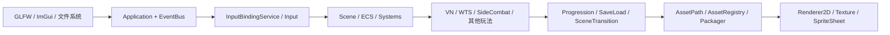
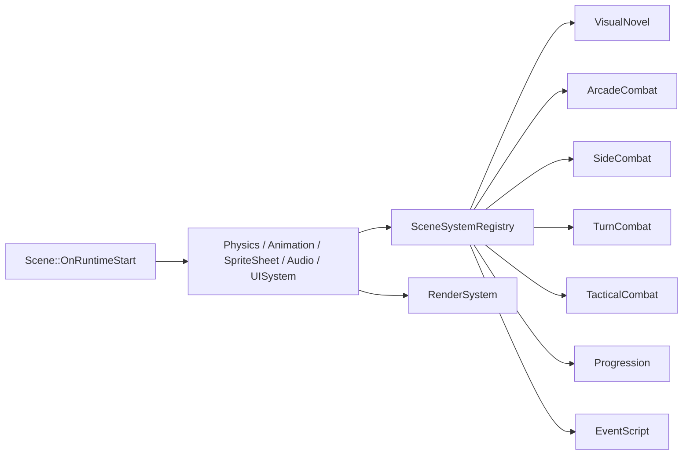
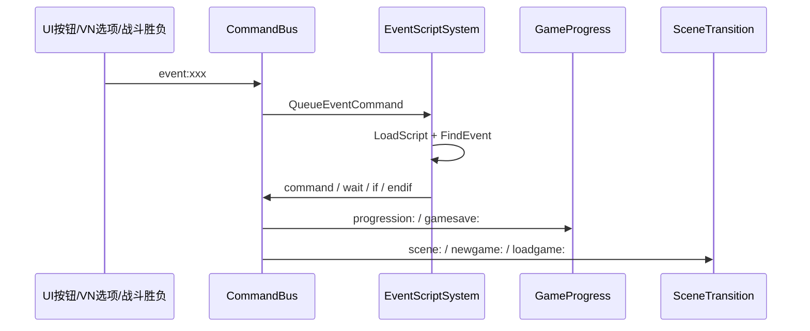
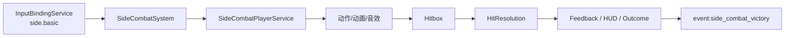
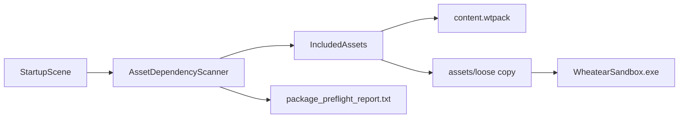

# 从地基到Sandbox · 合并优化版

> 这是把 `docs/从地基到Sandbox/00_总纲.md` 到 `15_打包发布.md` 按源码重新校对后整理出来的单文档。
> 原系列保留不动，这份是给顺读用的合订本。
>
> 先说三处已校正的点：
> - `Projects/WheatearDemo/assets/scenes/*.wt` 实际共 22 个场景。
> - `EventScriptComponent` 的源码默认值是 `RunOnStart = true`、`RunOnce = true`、`Enabled = true`；FlowController 里的 `false` 是场景配置。
> - `00_总纲.md` 中的 WTS 链接已统一到 `10_WTS事件脚本系统.md`。

## 全局图

## 1. 引擎底座（Part 1-3）

### Part 1 · 工程地基

`Application::Run()` 先 `glfwPollEvents()`，再统一 `FlushEventQueue()`，然后跑 Layer 更新、ImGui、`InputBindingService::EndFrame()`、`Input::EndFrame()`，最后交换缓冲。窗口回调只负责把 GLFW 事件翻译成引擎事件，不直接驱动玩法。

源码锚点：`Wheatear/src/Wheatear/Core/Application.cpp`、`Wheatear/src/Platform/Windows/WindowsWindow.cpp`、`Wheatear/src/Wheatear/Input/InputBindingService.cpp`

### Part 2 · 渲染地基

渲染分三层：`RendererAPI` 关住 OpenGL，`RenderCommand` 做静态门面，`Renderer2D` 负责合批。纹理缓存让“同一路径 = 同一个 rendererID”，32 个纹理槽内可以把大量精灵和 UI 元素压成极少 draw call。

源码锚点：`Wheatear/src/Wheatear/Renderer/Renderer2D.cpp`、`Wheatear/src/Wheatear/Renderer/Texture.cpp`、`Wheatear/src/Platform/OpenGL/OpenGLTexture.cpp`

### Part 3 · ECS 与场景

实体只是 `UUID + Scene*` 的门面，组件是纯数据，系统是逻辑。场景序列化把组件写成 YAML，`Scene::ConfigureRuntimeSystems()` 先挂基础系统，再由 `ModuleBootstrap::RegisterDefaultGameplayModules()` 把 VN、战斗、Progression、EventScript 等玩法系统插进运行时系统集。

源码锚点：`Wheatear/src/Wheatear/Scene/Scene.cpp`、`Wheatear/src/Wheatear/Scene/SceneSerializer.cpp`、`Wheatear/src/Wheatear/Modules/ModuleBootstrap.cpp`

## 2. 资产与编辑器（Part 4-6）

### Part 4 · 资产管线

`AssetPath::ResolveRuntimeData()` 先找 loose 文件，再回落项目路径和引擎根；`AssetAliasRegistry` 把 `content_manifest.yaml` 里的别名映射成真实路径。打包时 `AssetDependencyScanner` 从启动场景做依赖闭包，避免把整目录无脑拷进去。

源码锚点：`Wheatear/src/Wheatear/Assets/AssetPath.cpp`、`Wheatear/src/Wheatear/Assets/AssetAliasRegistry.cpp`、`WheatearEditor/src/Build/AssetDependencyScanner.cpp`

### Part 5 · 编辑器地基

编辑器本体就是引擎上的一层 ImGui 面板。DockSpace、视口 framebuffer、EntityID 拾取、ContentBrowser 缩略图、场景拖放和模块工具注册，都是围绕 `EditorLayerBase` 展开。

源码锚点：`WheatearEditor/src/Editor/EditorLayerBaseUI.cpp`、`WheatearEditor/src/Editor/EditorLayerBaseUI_Viewport.cpp`、`WheatearEditor/src/Modules/ModuleEditorBootstrap.cpp`

### Part 6 · 动画与图集

`AnimationClip` 管帧、属性轨道和事件轨道；`.wtsheet` 管规则格子、trim、命名矩形和碰撞框。`AnimationSystem` 播放时会把当前帧解析成 `SpriteSheetAsset::ResolvedCell`，再把 UV 和碰撞数据写回组件。

源码锚点：`Wheatear/src/Wheatear/Animation/AnimationClip.h`、`Wheatear/src/Wheatear/Systems/AnimationSystem.cpp`、`Wheatear/src/Wheatear/Assets/SpriteSheetAsset.cpp`

## 3. 输入与物理（Part 7-8）

### Part 7 · 输入系统

输入分三层：GLFW 事件、裸查询、语义动作。`InputBindingService` 管动作边沿和注入，`UserSettings` 保存用户重映射，`InputActionCatalog` 提供数据化默认键位。玩法只看 `side.jump`、`vn.advance` 这种动作名。

源码锚点：`Wheatear/src/Wheatear/Input/InputBindingService.cpp`、`Wheatear/src/Wheatear/Config/UserSettings.cpp`、`Wheatear/src/Wheatear/Input/InputActionCatalog.cpp`

### Part 8 · 物理

Box2D 只在运行时创建和销毁，编辑态不跑物理。`Rigidbody2DComponent` 和 `BoxCollider2DComponent` 保存权威数据，物理世界里的 body/fixture 只是运行时副本；动画驱动碰撞则在需要时重建 fixture。

源码锚点：`Wheatear/src/Wheatear/Systems/PhysicsSystem.cpp`、`Wheatear/src/Wheatear/Physics/ContactListener.cpp`、`Wheatear/src/Wheatear/Systems/SpriteSheetSystem.cpp`

## 4. VN 与 WTS（Part 9-9.5）

### Part 9 · VN 模块

VN 的剧本是纯文本 `.vn`，运行时是解释器，编辑器是文本工具。`VisualNovelInputService` 每帧采样输入快照，`VisualNovelRuntime` 只管推进行号、选择分支和历史记录，`VisualNovelSystem` 负责把状态写回场景实体。

源码锚点：`Wheatear/src/Wheatear/Modules/VisualNovel/VisualNovelScript.cpp`、`Wheatear/src/Wheatear/Modules/VisualNovel/VisualNovelRuntime.cpp`、`Wheatear/src/Wheatear/Modules/VisualNovel/VisualNovelSystem.cpp`

### Part 9.5 · WTS 事件脚本系统

`.wts` 站在 VN、UI 按钮、战斗胜负和场景切换中间，专门负责“什么时候做什么”。`EventScript.cpp` 支持 `event <name>` / `event:<name>`、`wait`、`if/endif`、`command/cmd`、裸命令和未知行保留；`EventScriptSystem` 负责热重载和逐帧执行，`CommandBus` 负责把 `scene:`、`newgame:`、`loadgame:`、`progression:`、`gamesave:`、`ui:`、`event:` 路由到对应系统。

源码锚点：`Wheatear/src/Wheatear/Scripting/EventScript.cpp`、`Wheatear/src/Wheatear/Scripting/EventScriptSystem.cpp`、`Wheatear/src/Wheatear/Runtime/CommandBus.cpp`

## 5. 横板战斗与 WAO（Part 10-11）

### Part 10 · SideCombat 与 WAO

SideCombat 的参数都在 `side_combat_tuning.yaml`，系统本体只做调度，真正的行为拆成玩家、AI、命中、反馈、HUD、结算等服务。键盘和 HUD 按钮都会汇入同一条 `InputBindingService::InjectActionPress()` 链路。WAO 则把动作抽成 `ActionIntent -> ActionRecipe -> EffectLedger`，让横板、回合、战棋共享同一套动作语义。

源码锚点：`Wheatear/src/Wheatear/Modules/SideCombat/SideCombatSystem.cpp`、`Wheatear/src/Wheatear/Modules/SideCombat/SideCombatPlayerService.cpp`、`Wheatear/src/Wheatear/Gameplay/Action/ActionDatabase.cpp`

### Part 11 · 其他玩法

回合制、战棋和弹幕不是另一套引擎，而是另一套规则。它们共享命令管道、WAO、输入、资产和系统注册模式，只是在相位机、网格寻路、弹幕生成这些规则域上各自实现自己的服务。

源码锚点：`Wheatear/src/Wheatear/Modules/TurnCombat/TurnCombatSystem.cpp`、`Wheatear/src/Wheatear/Modules/TacticalCombat/TacticalCombatSystem.cpp`、`Wheatear/src/Wheatear/Modules/ArcadeCombat/ArcadeCombatSystem.cpp`

## 6. 成长与素材（Part 12-13）

### Part 12 · 成长与据点

`GameProgress` 是跨场景全局状态，装着章节、材料、装备、技能、好感和上一次副本结果。`ProgressionContent` 负责把 manifest 和分文件内容读进来，据点页面服务把这些数据写回场景 UI，再通过 `progression:` 命令驱动解锁、强化和结算。

源码锚点：`Wheatear/src/Wheatear/Modules/Progression/GameProgress.cpp`、`Wheatear/src/Wheatear/Modules/Progression/ProgressionContent.cpp`、`Wheatear/src/Wheatear/Modules/Progression/ProgressionSkillTreePageService.cpp`

### Part 13 · 美术素材管线

素材来源分四类：程序化生成、AI 生图、动作视频抽帧、编辑器工具。最终都要落到引擎资产：PNG、`.wtsheet`、`.wtanim`、场景引用和数据表引用。`{expression}` 命名、图集命名和 tuning 字段是一条链，换图时能整链生效。

源码锚点：`docs/02_竖切版本/竖切美术资源批次包目录.md`、`WheatearEditor/src/Panels/SpriteSheetPickerPanel.cpp`、`docs/从地基到Sandbox/06_动画与图集.md`

## 7. 打包发布（Part 14）

### Part 14 · 打包发布

打包不是整目录复制，而是从启动场景做依赖闭包扫描，生成 `content.wtpack`、复制 loose runtime data、写 `player.config`，最后输出 `package_report.txt`。运行时继续走同一套 `AssetPath::ResolveRuntimeData()`，所以编辑态和发布态代码路径基本一致。

源码锚点：`WheatearEditor/src/Build/AssetDependencyScanner.cpp`、`WheatearEditor/src/Build/PlayerPackager.cpp`、`Wheatear/src/Wheatear/Assets/AssetPath.cpp`

## 收口

如果你只打算顺着读一份，就读这份；如果要回到原始分篇，就按上面的 Part 标题跳回去。这里的主线其实很简单：

**输入进来 -> 玩法处理 -> 命令总线转发 -> 脚本/战斗/成长响应 -> 场景和资产一起更新 -> 最后打包成同一套运行时。**
