# 从地基到 Sandbox · 合订本

> 这份文档把 `00_总纲` 到 `15_打包发布` 合并成一篇，按中文编号重排，并按源码重新校正。
> 已校正的点：22 个场景、`EventScriptComponent` 默认值、WTS 白名单命令、运行时系统注册顺序、打包预检与 `PackageName` 规则。

## 目录

1. 总纲
2. 工程地基
3. 渲染地基
4. ECS 与场景
5. 资产管线
6. 编辑器地基
7. 动画与图集
8. 输入系统
9. 物理
10. VN 模块
11. WTS 事件脚本系统
12. SideCombat 与 WAO
13. 其他玩法
14. 成长与据点
15. 美术素材管线
16. 打包发布

## 一、总纲（原 Part 0）

### 1、这个 Demo 到底是什么

Sandbox 是一个可完整游玩的 2D 竖切演示，主线从主菜单、VN 剧情、假玩法、正式横板战斗、Boss、结算，一路走到据点、成长、继续剧情与存读档。场景文件是 YAML，统一放在 `Projects/WheatearDemo/assets/scenes/*.wt`，当前一共有 22 个场景；场景之间不是靠代码硬跳，而是靠 `assets/events/sandbox_flow.wts` 这一层流程脚本串起来。

主线可粗略理解为：

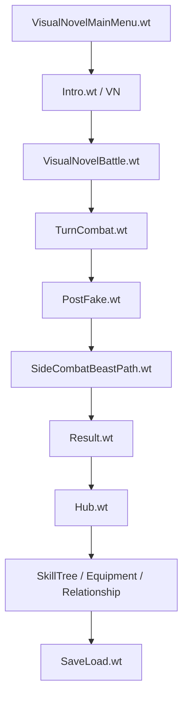

源码阅读：`Projects/WheatearDemo/assets/events/sandbox_flow.wts`、`Wheatear/src/Wheatear/Runtime/SceneTransitionService.cpp`、`Wheatear/src/Wheatear/Runtime/CommandBus.cpp`、`Wheatear/src/Wheatear/Scripting/EventScriptSystem.cpp`

### 1.1 三种运行时与一个编辑器

引擎本体是静态库，Sandbox 运行器和编辑器都链接同一份引擎代码。这样做的目的很直接：编辑器里看到的动画帧、碰撞框、图集裁切和运行时看到的是同一份场景数据，只是系统集行为不同。

```text
Wheatear        -> 静态库：渲染 / ECS / 资产 / 动画 / 输入 / 物理 / 玩法模块
WheatearSandbox -> 运行器：直接播放完整流程
WheatearEditor  -> 编辑器：ImGui 面板 + 内容生产工具
```

这也是这套工程最重要的边界：游戏和编辑器共用引擎，项目本质上就是一组资产目录。

源码阅读：`Wheatear/src/Wheatear/Core/Application.cpp`、`Wheatear/src/Wheatear/Core/EntryPoint.h`、`WheatearEditor/src/WheatearEditorApp.cpp`、`Wheatear/src/Wheatear/Modules/ModuleBootstrap.cpp`

### 1.2 美术素材从哪来

Sandbox 的素材分四类：程序化生成、AI 生图、动作视频抽帧、编辑器工具整理。最后都会落到引擎资产，通常是 PNG 加 `.wtsheet` 定义，不再以“散图”形式存在。

| 来源 | 内容 | 产物 |
| --- | --- | --- |
| 程序化生成 | 图标、VFX、部分 UI | 可重建 PNG |
| GPT-Image-2 | 立绘、背景、UI 皮肤 | 人工整理后的 PNG |
| 动作视频抽帧 | 角色动作序列 | 网格图集 PNG |
| 引擎工具 | 图集定义、裁切、碰撞框 | `.wtsheet` |

源码阅读：`WheatearEditor/src/Panels/SpriteSheetPickerPanel.cpp`、`WheatearEditor/src/Panels/AnimationEditorPanel.cpp`、`WheatearEditor/src/Assets/AssetRegistry.cpp`、`Wheatear/src/Wheatear/Assets/AssetPath.cpp`

### 1.3 阅读顺序

顺读这份合订本的最好方式，就是顺着“地基 -> 资产 -> 编辑器 -> 玩法 -> 成长 -> 打包”往下看。每一章末尾都保留了“当前状态”，方便知道这一阶段引擎已经具备了什么。

### 1.4 如何运行

```powershell
vendor\bin\premake\premake5.exe vs2022
powershell -NoProfile -ExecutionPolicy Bypass -File scripts\Build-WheatearEditor.ps1
bin\Debug-windows-x86_64\WheatearEditor\WheatearEditor.exe
bin\Debug-windows-x86_64\WheatearSandbox\WheatearSandbox.exe
```

源码阅读：`scripts/Build-WheatearEditor.ps1`、`premake5.lua`、`WheatearEditor/src/WheatearEditorApp.cpp`、`Wheatear/src/Wheatear/Core/EntryPoint.h`

### 1.5 当前状态

- ✅ 主线和 22 个场景关系已经跑通
- ✅ 编辑器与运行器共用同一套引擎
- ✅ 素材、场景、玩法和打包已经统一到数据驱动路径

## 二、工程地基（原 Part 1）

### 1、工程拓扑

仓库根目录由 premake5 生成一个 workspace，共有引擎、编辑器、Sandbox、第三方静态库等工程。引擎是静态库不是为了“省事”，而是为了让编辑器和运行器共享同一份实现和序列化逻辑。

源码阅读：`premake5.lua`、`Wheatear/src/wtpch.h`、`Wheatear/src/wtpch.cpp`、`WheatearEditor/src/wepch.h`

### 1.1 premake5 与 PCH

premake 负责生成工程文件，而不是手写 `.vcxproj`。源码新增后靠 glob 收集，编辑器和引擎各自使用自己的预编译头，重编译速度才压得住。

### 1.2 main() 只有三行

入口层很薄，所有 exe 都是 `CreateApplication -> Run -> delete` 这个套路。真正的行为都在 `Application` 里。

源码阅读：`Wheatear/src/Wheatear/Core/EntryPoint.h`、`WheatearEditor/src/WheatearEditorApp.cpp`、`Wheatear/src/Wheatear/Core/Application.cpp`

### 1.3 主循环 Application::Run

关键顺序是：先拉 GLFW 事件，再统一 flush 事件队列，然后跑更新与 ImGui，最后在帧末收输入状态机。

```cpp
while (m_Running)
{
    glfwPollEvents();
    FlushEventQueue();
    ...
    InputBindingService::EndFrame();
    Input::EndFrame();
    m_Window->OnUpdate();
    PostUpdateLayers();
}
```

这个顺序很重要：

- 事件不在 GLFW 回调里立即分发，而是统一在帧首处理
- `double` 时间差先算再转 `float`，避免长时间运行后毫秒精度抖动
- 输入状态机一定要在帧末滚动，否则“按一下只触发一次”的边沿判断会坏掉

源码阅读：`Wheatear/src/Wheatear/Core/Application.cpp`、`Wheatear/src/Wheatear/Input/InputBindingService.cpp`、`Wheatear/src/Wheatear/Input/Input.h`

### 1.4 窗口层与事件系统

`WindowsWindow.cpp` 只做一件事：把 GLFW 回调翻译成引擎事件，再交给 `EventBus`。引擎代码从不直接碰 GLFW 类型，这样窗口后端才好替换。

源码阅读：`Wheatear/src/Platform/Windows/WindowsWindow.cpp`、`Wheatear/src/Wheatear/Events/EventBus.cpp`、`Wheatear/src/Wheatear/Events/Event.h`

### 1.5 LayerStack 与端到端例子

Layer 是帧循环的外壳，Sandbox 和 Editor 都只是挂不同的主 Layer。最典型的端到端例子就是“VN 里点一下鼠标，下一句台词出现”：

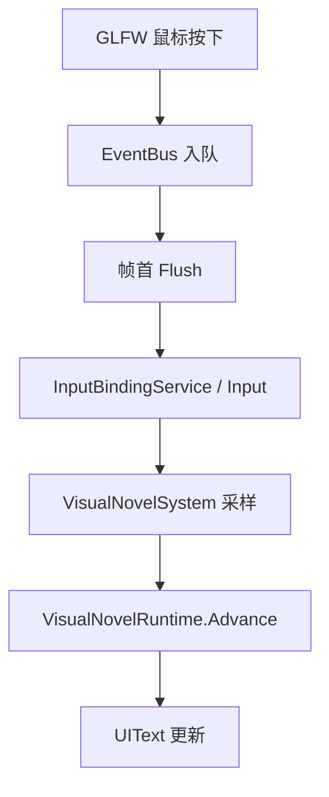

源码阅读：`Wheatear/src/Wheatear/Core/LayerStack.cpp`、`Wheatear/src/Wheatear/Modules/VisualNovel/VisualNovelSystem.cpp`、`Wheatear/src/Wheatear/Modules/VisualNovel/VisualNovelRuntime.cpp`

### 1.6 当前状态

- ✅ 窗口、主循环、事件队列都搭好
- ✅ 输入状态机和帧末收尾机制已固定
- ✅ LayerStack 支撑 Editor / Sandbox 两种宿主

## 三、渲染地基（原 Part 2）

### 1、为什么要分三层

渲染层分为 `RendererAPI`、`RenderCommand` 和 `Renderer2D` 三层。第一层关住 OpenGL，第二层提供统一门面，第三层负责合批与高层绘制逻辑。这样换后端时，上层不用重写。

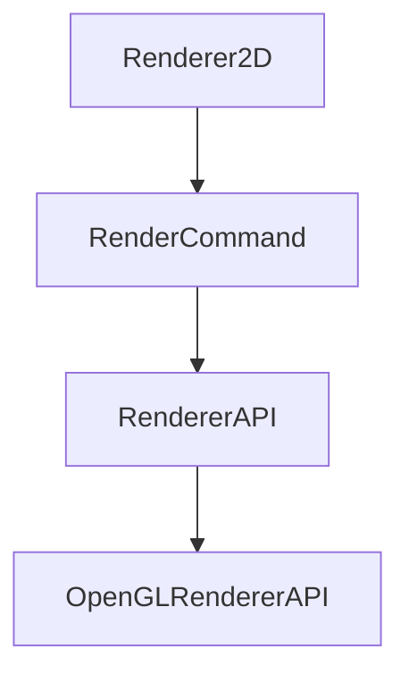

源码阅读：`Wheatear/src/Wheatear/Renderer/RendererAPI.cpp`、`Wheatear/src/Wheatear/Renderer/RenderCommand.cpp`、`Wheatear/src/Wheatear/Renderer/Renderer2D.cpp`、`Wheatear/src/Platform/OpenGL/OpenGLRendererAPI.cpp`

### 1.1 纹理：从 PNG 到 GPU

纹理加载使用 stb，并明确把图像上下翻转约定固定下来。纹理缓存的核心目标很简单：同一路径只进一次 GPU，否则合批时纹理槽会被同图多实例挤爆。

源码阅读：`Wheatear/src/Wheatear/Renderer/Texture.cpp`、`Wheatear/src/Platform/OpenGL/OpenGLTexture.cpp`

### 1.2 Renderer2D 的合批逻辑

`Renderer2D` 预分配批次缓冲，单批最多一万四边形，纹理槽最多 32 个。合批靠的是两件事：纹理缓存保证同图同 rendererID，顶点里再用 `TexIndex` 选择槽位。

### 1.3 相机与 EditorCamera

场景相机负责正交/透视投影，编辑器相机负责轨道与飞行两种操作模式。视口里看到的内容其实是场景先渲染到 framebuffer，再贴到 ImGui 面板上。

源码阅读：`Wheatear/src/Wheatear/Renderer/SceneCamera.cpp`、`Wheatear/src/Wheatear/Renderer/EditorCamera.cpp`、`Wheatear/src/Wheatear/Renderer/Renderer2D.cpp`

### 1.4 技能图标从场景文件到像素

战斗 HUD 的技能图标不是“手写贴图”，而是场景实体上的 `UIImageComponent` 加 `UIButtonComponent`。`SpriteSheetSystem` 先把 `.wtsheet` 里的命名矩形解析出来，再交给 `Renderer2D` 合批绘制。

### 1.5 性能上为什么值得这么做

逐精灵 `glDraw` 的成本主要在 CPU 提交，不在 GPU 画三角形。把绘制攒到 `EndScene` 才 flush，能把几百个精灵压成极少数 draw call，这就是 2D 引擎最值钱的优化。

### 1.6 当前状态

- ✅ OpenGL 已经被抽到平台层
- ✅ 纹理缓存和 32 槽合批成立
- ✅ 编辑器视口已经可以复用同一套 2D 渲染器

源码阅读：`Wheatear/src/Wheatear/Renderer/Renderer2D.cpp`、`Wheatear/src/Wheatear/Renderer/RenderCommand.cpp`、`Wheatear/src/Wheatear/Renderer/Texture.cpp`、`Wheatear/src/Platform/OpenGL/OpenGLTexture.cpp`、`Wheatear/src/Wheatear/Renderer/SceneCamera.cpp`、`Wheatear/src/Wheatear/Renderer/EditorCamera.cpp`

## 四、ECS 与场景（原 Part 3）

### 1、为什么是 ECS

这里用的是“实体是 ID、组件是数据、系统是逻辑”的 ECS 组织。这样做最直接的好处是缓存友好、组合优于继承、场景序列化也天然简单。

源码阅读：`Wheatear/src/Wheatear/Scene/Entity.h`、`Wheatear/src/Wheatear/Scene/Scene.cpp`、`Wheatear/src/Wheatear/Scene/SceneSerializer.cpp`

### 1.1 Entity 只是门面

`Entity` 本质上只是 `entt::entity + Scene*` 的轻量封装，所有组件增删查改都转发给 registry。`UUID` 则是场景引用和命令寻址的统一身份。

### 1.2 组件组织与序列化

组件按主题拆头文件，模块组件则保持在各自模块里，不塞进聚合头。场景序列化靠模板特化，一个组件一个 `ComponentSerializer<T>`，没有反射，也没有庞大的注册表。

### 1.3 双系统集

`Scene::ConfigureRuntimeSystems()` 先挂基础系统，再由 `SceneSystemRegistry` 插入玩法系统，最后才是 `RenderSystem`。编辑态和运行态各有一套系统集，行为不同但场景数据相同。

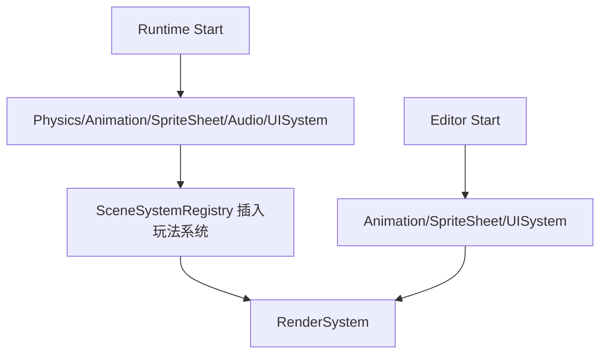

源码阅读：`Wheatear/src/Wheatear/Scene/Scene.cpp`、`Wheatear/src/Wheatear/Scene/SceneSystemRegistry.cpp`、`Wheatear/src/Wheatear/Modules/ModuleBootstrap.cpp`、`Wheatear/src/Wheatear/Scene/Serialization/SceneSerializerCoreComponents.cpp`

### 1.4 实体销毁不是立刻删

销毁走延迟队列，原因和 Layer 待办队列一样：不要在遍历容器时修改容器。这样即使系统正扫描 view，也不会把 registry 搞乱。

### 1.5 Example.wt 的加载链

场景从 YAML 读入，先重建实体，再按组件组反序列化，最后恢复父子层级与运行系统。编辑器打开场景和运行器加载场景，走的其实是同一条链。

### 1.6 当前状态

- ✅ entt 驱动的实体/组件/系统骨架成型
- ✅ YAML 场景序列化和组件组拆分完成
- ✅ 编辑态/运行态双系统集可切换

## 五、资产管线（原 Part 4）

### 1、资产引用的总原则

所有资产引用都写成项目相对路径字符串，不写绝对路径，也不直接写对象指针。这样 YAML 可读、可 diff、可热重载，也能在打包前做闭包扫描。

### 1.1 AssetPath 的双路径解析

`AssetPath` 负责两条路：编辑器里的 loose 文件优先，打包后的包内数据回落解析。`DiscoverProjectRoot()` 会从当前工作目录向上找项目根，这样编辑器从任意位置启动都能找到资产。

```cpp
const auto loosePath = FindLooseRuntimeData(path);
if (!loosePath.empty())
    return loosePath;
return Resolve(path);
```

源码阅读：`Wheatear/src/Wheatear/Assets/AssetPath.cpp`、`Wheatear/src/Wheatear/Assets/FileSystem.cpp`

### 1.2 编辑器资产注册表

`AssetRegistry` 是编辑器进程侧的资产数据库，负责按扩展名分类、记住导入参数、支撑 ContentBrowser 的图标和双击行为。运行时并不依赖这张表，运行时只关心路径和格式。

源码阅读：`WheatearEditor/src/Assets/AssetRegistry.cpp`、`WheatearEditor/src/Panels/ContentBrowserPanel.cpp`

### 1.3 热重载与降频

热重载不是每帧盯文件系统，而是记录 `last_write_time`，再配合 250ms 或 500ms 的探测闸。VN 剧本、战斗 tuning、WAO 动作表、`SpriteSheetAsset` 和资源浏览器都用了类似策略。

### 1.4 资产格式

Sandbox 里实际在用的格式大致是：`.wt` 场景、`.wtsheet` 图集定义、`.wtanim` 动画片段、`.vn` 剧本、`.wts` 事件脚本，以及 YAML/PNG/WAV 这些基础素材。

### 1.5 `.wtsheet` 的完整链路

`.wtsheet` 把图集从“图”提升成“资产定义”。编辑器里改网格、改裁切、改命名矩形，运行时下一次热重载就会跟着变，不需要手工重烘焙整条链。

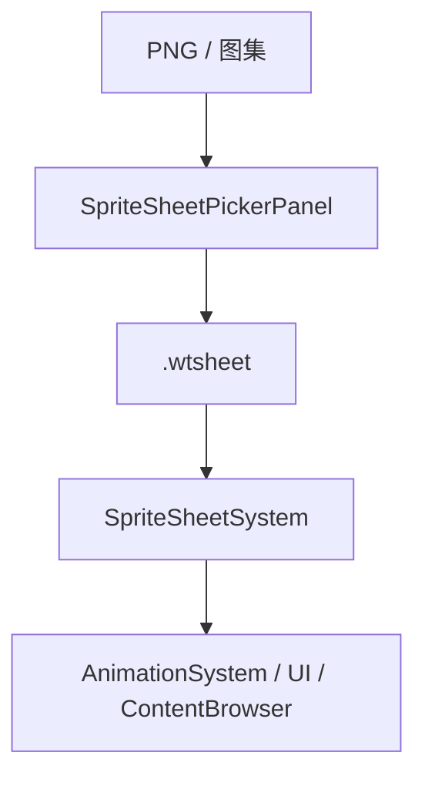

源码阅读：`Wheatear/src/Wheatear/Assets/SpriteSheetAsset.cpp`、`Wheatear/src/Wheatear/Systems/SpriteSheetSystem.cpp`、`WheatearEditor/src/Panels/SpriteSheetPickerPanel.cpp`

### 1.6 项目化与打包目录

项目就是资产目录，默认项目在 `Projects/WheatearDemo`。打包产物会落到 `Builds/Windows/Player/<打包名>/`，而编辑器包会落到 `Builds/Windows/Editor/`。

### 1.7 当前状态

- ✅ 项目根/引擎根双路径解析成立
- ✅ 编辑器注册表和热重载可工作
- ✅ `.wtsheet` 已经成为素材管线的核心定义层

## 六、编辑器地基（原 Part 5）

### 1、编辑器到底是什么

编辑器不是另一套引擎，而是引擎上面再包一层 ImGui 面板。启动后先经过 `ModeSelectLayer` 选 2D/3D 和项目目录，再挂上 `EditorLayer2D/3D`。

### 1.1 面板体系

`EditorLayerBase` 持有层级树、资源浏览器、动画编辑器、图集分割器、输入绑定面板、帮助面板等一堆工具窗口。面板本身只是普通类，每帧由 EditorLayer 统一调用 `OnImGuiRender()`。

源码阅读：`WheatearEditor/src/Editor/EditorLayerBase.cpp`、`WheatearEditor/src/Editor/EditorLayerBaseUI.cpp`、`WheatearEditor/src/Modules/ModuleEditorBootstrap.cpp`

### 1.2 工具注册与浮动窗口

模块工具并不是硬编码在一个巨大 Editor 文件里，而是由模块各自注册。这样新增玩法模块时，可以自己带着面板和 drawer 一起进编辑器。

### 1.3 视口渲染

视口是编辑器心脏：场景先渲染到 framebuffer，再把颜色附件贴回 ImGui。拾取则靠 framebuffer 的 EntityID 附件，点哪个像素就知道选中了谁。

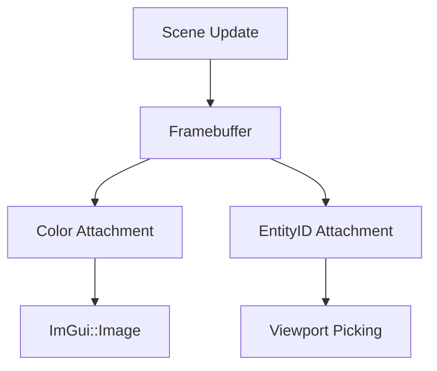

源码阅读：`WheatearEditor/src/Editor/EditorLayerBaseUI_Viewport.cpp`、`Wheatear/src/Wheatear/Renderer/Framebuffer.cpp`、`Wheatear/src/Wheatear/Renderer/RenderCommand.cpp`

### 1.4 视口交互

gizmo、拖放资产、相机控制、双击聚焦，这些交互都不是“特判逻辑”，而是围绕场景和命令历史做的编辑器层能力。拖放和结构修改都会延迟到帧尾执行，避免在 ImGui 回调里直接改场景。

### 1.5 资源浏览器

ContentBrowser 既有目录扫描缓存，也有离屏缩略图，还能展开 `.wtsheet` 的格子条带。图集、场景、预制体和文本资产都能在这里被拖进场景。

### 1.6 摆一个精灵

流程就是：开场景、新建实体、拖 PNG 到 SpriteRenderer、在视口里调 gizmo、保存场景。编辑器里看到什么，运行器里基本就是什么。

### 1.7 当前状态

- ✅ DockSpace 面板体系已经成型
- ✅ 视口 framebuffer 和拾取逻辑可用
- ✅ 资源浏览器、图集分割器、帮助面板都已接入

源码阅读：`WheatearEditor/src/Editor/EditorLayerBase.cpp`、`WheatearEditor/src/Editor/EditorLayerBaseUI.cpp`、`WheatearEditor/src/Editor/EditorLayerBaseUI_Viewport.cpp`、`WheatearEditor/src/Panels/ContentBrowserPanel.cpp`、`WheatearEditor/src/Panels/SpriteSheetPickerPanel.cpp`、`WheatearEditor/src/Panels/SceneHierarchy/SceneHierarchyPanel.cpp`

## 七、动画与图集（原 Part 6）

### 1、AnimationClip 是三件套

动画数据分三层：帧序列、属性轨道、事件轨道。帧负责贴图，轨道负责颜色/位置/缩放等变化，事件负责在正确时机发命令。

### 1.1 播放系统

`AnimationSystem` 在编辑态只同步预览帧，在运行态完整播放。它会先按时间找到当前帧，再尝试从 `.wtsheet` 解析出真正的 UV、内容尺寸和碰撞框。

### 1.2 `.wtsheet` 的三层能力

| 能力 | 作用 |
| --- | --- |
| 规则网格 | 处理标准图集帧 |
| trim 裁切 | 消掉留白，避免动作抖动 |
| 命名矩形 | 处理不规则 UI/HUD 图块 |
| 每格碰撞框 | 让碰撞跟随动画 |

`PixelsPerUnit > 0` 时，渲染尺寸和碰撞尺寸都按同一基准换算，所以动画换帧时不会在世界里飘。

### 1.3 动画事件与命令

动画事件不是直接去改系统，而是发到 `CommandBus`。命令可以播放动画、触发战斗结算、做镜头反馈，也可以把逻辑推给别的模块。

源码阅读：`Wheatear/src/Wheatear/Animation/AnimationClip.h`、`Wheatear/src/Wheatear/Animation/AnimationClipSerializer.cpp`、`Wheatear/src/Wheatear/Systems/AnimationSystem.cpp`、`Wheatear/src/Wheatear/Systems/SpriteSheetSystem.cpp`

### 1.4 编辑器生产

`SpriteSheetPickerPanel` 是图集工作流的最后一站：切网格、检测内容边界、手工微调、给碰撞框、保存成 `.wtsheet`，再把格子或命名矩形喂给动画编辑器。

### 1.5 idle 动画例子

主角 idle 动画本身只是 tuning 里的一段描述，但它背后实际上会映射到 `protag_idle_sheet.wtsheet`、`AnimationClip("idle")` 和运行时的 `ResolveCell`。所以改图集，不需要改播放逻辑。

### 1.6 当前状态

- ✅ AnimationClip、序列化器和播放系统已经联动
- ✅ `.wtsheet` 成为帧、裁切和碰撞的统一定义
- ✅ 编辑器分割器可以直接产出可运行资产

源码阅读：`Wheatear/src/Wheatear/Animation/AnimationClip.h`、`Wheatear/src/Wheatear/Animation/AnimationClipSerializer.cpp`、`Wheatear/src/Wheatear/Systems/AnimationSystem.cpp`、`Wheatear/src/Wheatear/Systems/SpriteSheetSystem.cpp`、`WheatearEditor/src/Panels/AnimationEditorPanel.cpp`、`WheatearEditor/src/Panels/SpriteSheetPickerPanel.cpp`

## 八、输入系统（原 Part 7）

### 1、输入三层结构

输入分三层：GLFW 事件、轮询查询、语义动作。第一层负责把外部输入变成内部状态，第二层直接读物理状态，第三层把键位抽象成动作名。

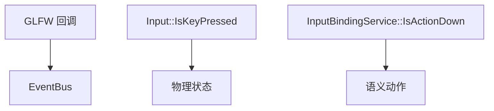

源码阅读：`Wheatear/src/Wheatear/Input/Input.h`、`Wheatear/src/Wheatear/Input/InputBindingService.cpp`、`Wheatear/src/Wheatear/Input/InputActionCatalog.cpp`、`Wheatear/src/Wheatear/Config/UserSettings.cpp`

### 1.1 查询层

`Input` 只管轮询，不维护复杂状态。鼠标位移靠两次轮询的差值，和事件系统没直接关系。

### 1.2 动作层与负编码

动作绑定是这层最重要的东西。鼠标按钮用负编码塞进同一套键码空间，所以 `side.basic` 可以同时绑定 `J` 和鼠标左键。

```cpp
AddBinding(settings, "side.jump",  { WT_KEY_K, WT_KEY_SPACE });
AddBinding(settings, "vn.advance", { WT_KEY_SPACE, WT_KEY_ENTER, WT_KEY_RIGHT });
AddBinding(settings, "side.basic", { WT_KEY_J, -1 });
```

### 1.3 边沿状态机

`IsActionPressed()` 的语义是“本帧按住且上一帧没按住”。所以 `EndFrame()` 必须在所有 Layer 查完之后才做，不然边沿就乱了。

### 1.4 动作数据化

后面的升级把默认动作迁到 `action_bindings.yaml`，用户重映射、Catalog 默认键和 C++ 内置表形成回退链。这样新动作、新技能、新道具键位可以尽量不改代码。

### 1.5 当前状态

- ✅ 事件、查询、动作三层都可用
- ✅ 鼠标负编码和动作重映射已接通
- ✅ 输入动作开始数据化，不再完全依赖 C++

源码阅读：`Wheatear/src/Wheatear/Input/Input.h`、`Wheatear/src/Wheatear/Input/InputBindingService.cpp`、`Wheatear/src/Wheatear/Input/InputActionCatalog.cpp`、`Wheatear/src/Wheatear/Config/UserSettings.cpp`

## 九、物理（原 Part 8）

### 1、Box2D 为什么是会话式世界

物理世界只在运行时创建和销毁，编辑态不常驻 Box2D。场景里权威的是组件，Box2D 只是运行时副本，退出 Play 就会整个 world 释放掉。

### 1.1 实体和 Box2D 的映射

刚体创建时，把实体 UUID 写进 `b2Body` 的 user data，回调时才能反查回实体。`RuntimeBody` 和 `RuntimeFixture` 只是运行时指针，不会进序列化。

### 1.2 动画驱动碰撞

碰撞盒不是只看初始尺寸，而是可以跟着动画帧的内容框变化。数据层先把 `.wtsheet` 里的 collider 写进组件，物理层再比对当前 fixture，不一样才重建。

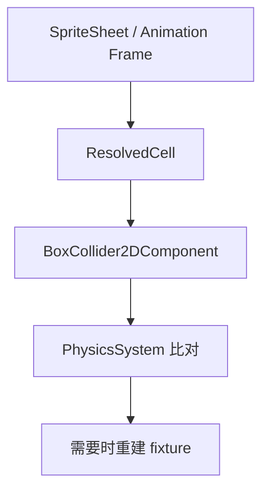

### 1.3 ContactListener

ContactListener 现在主要保留 UUID 回查和接触报告能力，真正的战斗命中判定不靠 Box2D contact，而是玩法模块自己的 hitbox 逻辑。这样物理和玩法规则就不会互相绑死。

### 1.4 SideCombat 自研物理

横板战斗主角不是靠 Box2D 推着走，而是 `SideCombatPhysicsService` 自己处理重力、跳跃、浮空和纵深位移。Box2D 留给平台型碰撞和需要刚体的场景。

### 1.5 当前状态

- ✅ 运行时 Box2D 会话化
- ✅ 组件是权威，fixture 是副本
- ✅ 动画驱动碰撞已经接上

源码阅读：`Wheatear/src/Wheatear/Systems/PhysicsSystem.cpp`、`Wheatear/src/Wheatear/Physics/ContactListener.cpp`、`Wheatear/src/Wheatear/Systems/SpriteSheetSystem.cpp`、`Wheatear/src/Wheatear/Modules/SideCombat/SideCombatPhysicsService.cpp`

## 十、VN 模块（原 Part 9）

### 1、剧本就是文本

VN 剧本是纯文本 `.vn`，不是场景文件。它的常见命令包括标签、背景、音乐、角色注册、立绘显示、表情切换、选项、条件和结束。

### 1.1 解释器三件套

`VisualNovelScript` 负责解析文本，`VisualNovelRuntime` 负责当前播放状态，`VisualNovelSystem` 负责每帧采样输入并把状态写回场景实体。简单说就是“解析一次，播放读流”。

### 1.2 立绘与表情

角色立绘常用 `aoba_{expression}.png` 这种模板，切表情就是换路径。若立绘实体本身也挂了动画剪辑，则优先走动画，静态 PNG 只是兜底。

### 1.3 选项与条件显示

选项会被解析成可点击按钮，条件门控则读取 `GameProgress` 里的旗标、解锁状态和变量。VN 不自己管全局进度，它只读和写共享状态。

### 1.4 存档

VN 的进度本质上是剧本文件路径、行号和状态变量快照。它和 `GameProgress` 一起构成跨场景保存的核心数据。

### 1.5 编辑器

VN 编辑器是文本工具，不是另起一套引擎。结构化行、Raw 行和 500ms 热重载把“写剧本”和“跑剧本”压成了同一套流程。

### 1.6 当前状态

- ✅ `.vn` 已经能承载剧情、选项和条件
- ✅ 解释器、运行时、编辑器三者已经接通
- ✅ 立绘模板替换和表情动画优先都可用

源码阅读：`Wheatear/src/Wheatear/Modules/VisualNovel/VisualNovelScript.cpp`、`Wheatear/src/Wheatear/Modules/VisualNovel/VisualNovelRuntime.cpp`、`Wheatear/src/Wheatear/Modules/VisualNovel/VisualNovelSystem.cpp`、`Wheatear/src/Wheatear/Modules/VisualNovel/VisualNovelInputService.cpp`、`WheatearEditor/src/Modules/VisualNovel/VisualNovelDrawer.cpp`、`WheatearEditor/src/Modules/VisualNovel/VisualNovelScriptEditorPanel.cpp`

## 十一、WTS 事件脚本系统（原 Part 9.5）

### 1、为什么需要 .wts

`.wts` 负责的是“什么时候做什么”，而不是“每帧怎么动”。VN 选项、UI 按钮、战斗胜负、存档、切场景这些低频流程，全都可以在这里统一编排。

### 1.1 三个核心对象

WTS 由三部分组成：`.wts` 资产、场景里的 `EventScriptComponent`、运行时的 `EventScriptSystem`。场景里常见的 `FlowController` 其实只是一个挂着脚本组件的实体名。

`EventScriptComponent` 的源码默认值是：

```cpp
bool RunOnStart = true;
bool RunOnce = true;
bool Enabled = true;
```

但 Sandbox 里的 FlowController 场景配置通常会显式写成 `RunOnStart: false`、`RunOnce: false`，因为这些流程控制器是要等按钮或战斗胜负发出 `event:` 才开始跑的。

源码阅读：`Wheatear/src/Wheatear/Scene/Components/ScriptComponents.h`、`Wheatear/src/Wheatear/Scene/Serialization/SceneSerializerScriptingComponents.cpp`、`Wheatear/src/Wheatear/Scripting/EventScriptSystem.cpp`

### 1.2 脚本长什么样

解析器支持 `event <name>`、`event:<name>`、`command/cmd`、`wait`、`if/endif`、`end`、以及裸命令和未知行保留。运行时不会把未知行删除，而是保留成 `RawLine`，这样图形编辑器写回时不会损坏手写内容。

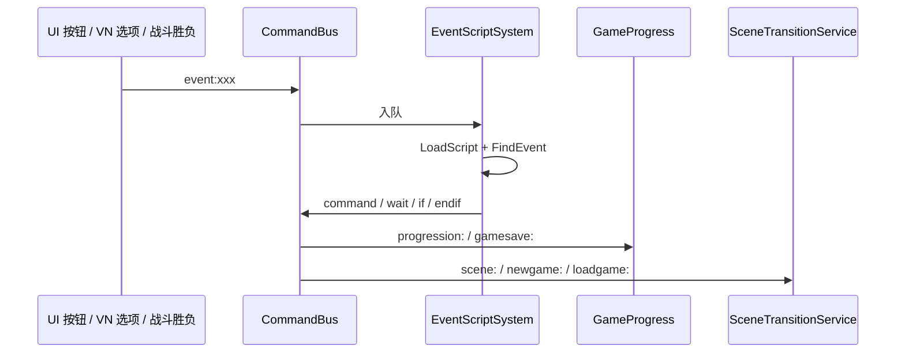

源码阅读：`Wheatear/src/Wheatear/Scripting/EventScript.cpp`、`Wheatear/src/Wheatear/Runtime/CommandBus.cpp`

### 1.3 CommandBus 的职责

CommandBus 会把 `quit`、`scene:`、`newgame:`、`loadgame:`、`progression:`、`anim:`、`ui:`、`event:` 这些命令直接处理掉。带玩法前缀的命令则会按注册前缀路由，比如 `vn:`、`gamesave:`、`turn:`、`tactic:`、`side:`。

```cpp
CommandBus::RegisterGameplayCommandPrefix("vn:");
CommandBus::RegisterGameplayCommandPrefix("gamesave:");
CommandBus::RegisterGameplayCommandPrefix("turn:");
CommandBus::RegisterGameplayCommandPrefix("tactic:");
CommandBus::RegisterGameplayCommandPrefix("side:");
```

源码阅读：`Wheatear/src/Wheatear/Runtime/CommandBus.cpp`、`Wheatear/src/Wheatear/Modules/ModuleBootstrap.cpp`

### 1.4 条件系统

条件判断读取的是 `GameProgress::GetState()`，所以旗标、章节、材料、装备、上一次副本结果都能直接拿来做分支。这里没有 `else`，需要分流就写多个 `if` 或拆成多个事件块。

### 1.5 运行时执行链

主菜单的“新游戏”就是最典型的一条链：按钮发 `event:menu_new_game`，事件脚本再触发 `newgame:`，接着交给场景切换服务。WTS 负责编排，真正的切场景和读写存档都由下层系统完成。

### 1.6 热重载与等待

脚本也有缓存和写入时间判断，文件改了就能重新加载。`wait` 不是阻塞线程，而是让脚本状态机在接下来几帧暂停推进，其他系统照常跑。

### 1.7 编辑器怎么维护

Event Script Editor 有 Graph 和 Raw 两种视图，适合分别处理结构化流程和暂时没有控件的指令。保存后还是普通 `.wts` 文本，所以编辑器不是专用编译器，只是更好用的工具层。

### 1.8 Sandbox 主流程

主线脚本把 22 个场景串成一条可游玩的路径。新游戏、假玩法、真战斗、胜利结算、据点回流、材料副本、存读档，全都能在一个脚本里找到对应入口。

### 1.9 什么时候用，什么时候不用

适合 `.wts` 的，是按钮、场景跳转、条件分支、等待、流程编排；不适合 `.wts` 的，是每帧移动、敌人 AI、高频碰撞和复杂状态机。边界原则很简单：数据表负责“是什么”，`.wts` 负责“什么时候做什么”，C++ 负责高频规则和复杂状态。

### 1.10 常见坑

- `RunOnce` 默认是 true，流程控制器要记得关掉
- 裸命令范围有限，复杂命令最好显式写 `command`
- 广播 `event:` 会命中所有脚本组件，多控制器时用 `@UUID`
- `scene:` 是请求，不是立刻中断当前函数

### 1.11 当前状态

- ✅ `.wts` 解析、运行、热重载都已经落地
- ✅ 事件脚本和 CommandBus 已打通
- ✅ Sandbox 主流程已集中到 `sandbox_flow.wts`

## 十二、SideCombat 与 WAO（原 Part 10）

### 1、数据表驱动：一切参数都是资产

SideCombat 的调参集中在 `side_combat_tuning.yaml`。战斗手感、敌人参数、动画剪辑、技能槽、道具槽、HUD 布局，都是数据，不是硬编码。

### 1.1 服务分层

系统本体只做调度，真正的逻辑被拆成很多服务：玩家、AI、命中盒、命中结算、视觉、反馈、HUD、结果、调参等。这样做的目的就是“系统薄，服务厚”。

### 1.2 输入 -> 动作

HUD 按钮和键盘按键共用同一条链路，都会落到 `InputBindingService::InjectActionPress()`。也就是说，UI 点击和键盘按下对玩法来说没有本质差别。

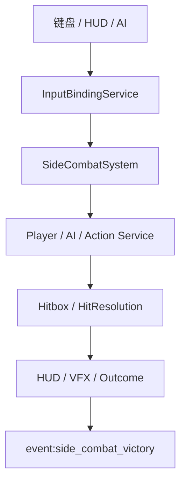

### 1.3 WAO 动作编排

WAO 是跨玩法的动作语义层，典型链路是 `ActionIntent -> ActionRecipe -> EffectBundle -> EffectLedger -> ActionSignalRouter`。它的意义不是替代玩法，而是让横板、回合制、战棋、弹幕都能共享同一套动作表达。

```cpp
struct ActionIntent
{
    UUID Actor;
    std::string ActionId;
    UUID ExplicitTarget;
};

struct ActionRecipe
{
    std::string Id;
    float Cooldown;
    float Duration;
    float Startup;
    float Recovery;
    float HitTime;
};
```

源码阅读：`Wheatear/src/Wheatear/Gameplay/Action/ActionDatabase.cpp`、`Wheatear/src/Wheatear/Gameplay/Action/ActionResolver.cpp`、`Wheatear/src/Wheatear/Gameplay/Action/ActionRunner.cpp`、`Wheatear/src/Wheatear/Gameplay/Action/EffectFormula.cpp`、`Wheatear/src/Wheatear/Gameplay/Action/EffectRegistry.cpp`

### 1.4 AI 与 HUD

敌人 AI 也是动作意图的来源之一，不需要走另一套输入系统。HUD 则把战斗状态写回场景实体，所以 HUD 本质上也是数据驱动渲染。

### 1.5 一次 basic 攻击

按下 J 或点技能图标后，动作服务查配方、检查冷却、播放动画、生成 hitbox、结算命中、触发反馈、推进连招窗口，最后把结果写进调试账本。这个链路串起了输入、动画、渲染、命中和命令系统。

### 1.6 数据驱动扩展

后续把道具槽、技能槽、效果公式和自定义技能行为都推进到编辑器里了。新效果可以是表达式，也可以是注册表 handler，新技能也可以通过 `SideCombatSkillRegistry` 变成可编排项。

### 1.7 架构边界：以弹反为例

弹反是一个很好的分界测试：按键触发动作很容易，但“窗口内持续检测来袭子弹并反向”需要可挂起状态和跨实体查询。当前架构能做的，是一次 C++ 注册加编辑器调参；如果要纯编辑器化，就得补行为状态机和实体查询原语。

### 1.8 敌人波次数据驱动

关卡不必再把小兵实体一个个拖进视口，而是用波次表描述生成规则。运行时会按表生成敌人、影子实体和后续波次逻辑，静态摆件则可以继续保留在场景里。

### 1.9 HUD 打磨

触摸摇杆、状态图标队列、Boss 保护条和技能栏布局都已经数据化。HUD 不再只是“贴几个图标”，而是整套战斗状态反馈层。

### 1.10 当前状态

- ✅ SideCombat 已经是系统薄、服务厚、数据驱动
- ✅ WAO 让多玩法共享动作/效果/信号语义
- ✅ 输入、动画、HUD、结算都已经统一进同一条链路

源码阅读：`Wheatear/src/Wheatear/Modules/SideCombat/SideCombatSystem.cpp`、`Wheatear/src/Wheatear/Modules/SideCombat/SideCombatPlayerService.cpp`、`Wheatear/src/Wheatear/Modules/SideCombat/SideCombatActionService.cpp`、`Wheatear/src/Wheatear/Modules/SideCombat/SideCombatTuningService.cpp`、`Wheatear/src/Wheatear/Modules/SideCombat/SideCombatHudService.cpp`、`Wheatear/src/Wheatear/Modules/SideCombat/SideCombatOutcomeService.cpp`、`Wheatear/src/Wheatear/Modules/SideCombat/SideCombatEnemyAIService.cpp`、`Wheatear/src/Wheatear/Modules/SideCombat/SideCombatHitboxService.cpp`、`Wheatear/src/Wheatear/Modules/SideCombat/SideCombatHitResolutionService.cpp`、`Wheatear/src/Wheatear/Modules/SideCombat/SideCombatVisualService.cpp`、`Wheatear/src/Wheatear/Modules/SideCombat/SideCombatFeedbackService.cpp`、`Wheatear/src/Wheatear/Modules/SideCombat/SideCombatSkillRegistry.cpp`、`Wheatear/src/Wheatear/Modules/GameplayModuleRuntime.h`

## 十三、其他玩法（原 Part 11）

### 1、通用骨架

回合制、战棋和弹幕不是另一套引擎，而是另一套规则。它们共享命令管道、动作层、渲染、输入和资产系统，只是在相位机、网格、射击规则这些地方各自实现自己的服务。

### 1.1 回合制

回合制的核心是相位状态机：等待指令、等待目标、执行、胜利、失败。演出和结算也通过命令总线解耦，所以表现和规则不会绑死。

### 1.2 战棋

战棋复用同一套动作和效果结构，区别只在意图产生方式变成了格子寻路、行动点数和范围攻击。单位参数也走 YAML，编辑器能直接把表应用到场景。

### 1.3 弹幕

ArcadeCombat 是最简单直接的验证：移动、射击、弹幕生成。它证明了新增玩法的成本主要在规则，而不是重新造引擎。

### 1.4 复用模式总结

| 层 | 复用内容 | 模块差异 |
| --- | --- | --- |
| 引擎 | 渲染 / ECS / 资产 / 输入 / 物理 / 动画 | 无 |
| 命令管道 | RuntimeRequestedCommand -> CommandBus | 前缀不同 |
| WAO | Recipe / Effect / Ledger / Signal | 意图来源不同 |
| 系统+服务 | 薄系统 + 服务集 | 规则域不同 |
| 数据表 | YAML + 热重载 | 表内容不同 |

源码阅读：`Wheatear/src/Wheatear/Modules/TurnCombat/TurnCombatSystem.cpp`、`Wheatear/src/Wheatear/Modules/TacticalCombat/TacticalCombatSystem.cpp`、`Wheatear/src/Wheatear/Modules/ArcadeCombat/ArcadeCombatSystem.cpp`、`Wheatear/src/Wheatear/Modules/GameplayModuleRuntime.h`

### 1.5 当前状态

- ✅ 四玩法模块共用底座
- ✅ 回合 / 战棋 / 弹幕都已按各自规则落地
- ✅ 表现和规则已经通过命令总线分离

## 十四、成长与据点（原 Part 12）

### 1、GameProgress 是全局状态

跨场景共享的进度都放进 `GameProgress`，包括章节、材料、装备、技能、关系、当前目标、上一个场景和副本结果。它是进程级单例，不属于任何一个场景。

### 1.1 内容定义与 Manifest

`GameProgress` 负责“玩家当前有什么”，而 `ProgressionContent` 负责“游戏里有什么”。后者一般通过一个 manifest 再拼接多个分文件来读，编辑器保存后会重新载入。

### 1.2 据点页面服务化

技能树、装备、关系、结算、设置等据点页面都被拆成服务。场景实体只负责 UI，服务负责把状态写回 UI，再把按钮点击转成命令。

### 1.3 成长循环

战斗掉落材料，材料用于据点强化，强化影响属性，属性又回到战斗里。剧情里的选择也会改 StoryFlags 或关系记录，再反过来影响后续战斗与对话。

### 1.4 存档系统

存档不是单一文件，而是“进度快照 + 当前场景路径 + VN 播放位置”这几部分共同组成。这样才既能恢复主线，也能恢复文本剧情状态。

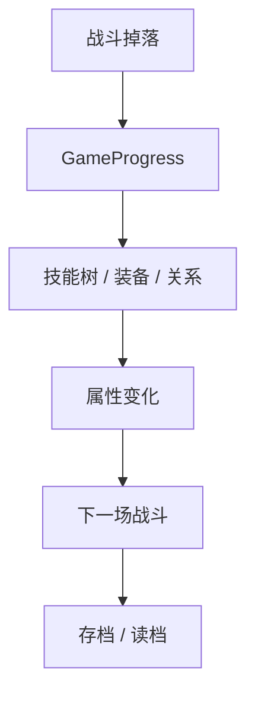

源码阅读：`Wheatear/src/Wheatear/Modules/Progression/GameProgress.cpp`、`Wheatear/src/Wheatear/Modules/Progression/ProgressionContent.cpp`、`Wheatear/src/Wheatear/Modules/Progression/ProgressionSkillTreePageService.cpp`、`Wheatear/src/Wheatear/Modules/Progression/ProgressionEquipmentPageService.cpp`、`Wheatear/src/Wheatear/Modules/Progression/ProgressionSaveLoadPageService.cpp`

### 1.5 当前状态

- ✅ 全局状态、内容定义、页面服务和存档已经打通
- ✅ 战斗、VN 和据点已经共用同一份进度数据
- ✅ 成长循环已经闭环

## 十五、美术素材管线（原 Part 13）

### 1、四类来源

素材生产不是单一路线，而是四类来源一起工作：程序化生成、AI 生图、视频抽帧、编辑器整理。最后真正进入引擎的不是“原始产物”，而是可引用的资产定义。

### 1.1 程序化生成

适合生成功能性素材，比如图标底框、通用粒子、UI 装饰线。这类素材最重要的是可重建，而不是靠手工一张一张改。

### 1.2 AI 生图

立绘、背景和 UI 皮肤通常走 AI 生图和人工筛选。关键是命名规范要跟引擎的数据模板对齐，比如 `{expression}` 这种占位符。

### 1.3 视频抽帧

战斗动作序列常常先从视频生成，再逐帧抽图、抠图、排成网格图集。只要有了 `.wtsheet`，运行时就能按帧索引或命名矩形引用。

### 1.4 分割器是最后一站

素材管线最后都要过 `SpriteSheetPickerPanel`：切网格、看内容边界、调 trim、配碰撞框、保存 sheet。也就是说，PNG 是原料，`.wtsheet` 才是最终定义。

源码阅读：`WheatearEditor/src/Panels/SpriteSheetPickerPanel.cpp`、`WheatearEditor/src/Panels/AnimationEditorPanel.cpp`、`WheatearEditor/src/Assets/AssetRegistry.cpp`、`Wheatear/src/Wheatear/Assets/AssetPath.cpp`

### 1.5 当前状态

- ✅ 四类素材来源都已接入同一条资产链
- ✅ 命名规范和引擎数据模板已经对齐
- ✅ 图集分割器已经是素材管线的标准终点

## 十六、打包发布（原 Part 14）

### 1、打包的目标

打包不是整目录复制，而是生成一个独立可运行目录：运行器、被依赖的资产、打包索引和报告都放在一起。发布态和编辑态共用同一套路径解析逻辑，所以运行时不需要另起一套代码路径。

```text
Builds/Windows/Player/<打包名>/
├── WheatearSandbox.exe
├── assets/
├── content.wtpack
└── package_report.txt
```

### 1.1 依赖扫描

`AssetDependencyScanner` 从启动场景出发做递归闭包扫描，场景引用的纹理、图集、动画、脚本、音频和转场都会被纳入结果。它还会排除不该打包的内容，比如缓存、备份、临时文件和项目化以外的东西。

### 1.2 Player 组装

`PlayerPackager` 会把扫描结果写成 `content.wtpack`，再拷贝 loose 资产、写 `player.config`、输出报告。`PackageName` 取自项目 `assets/game/player.config`，没有配置时才回退到项目短名。

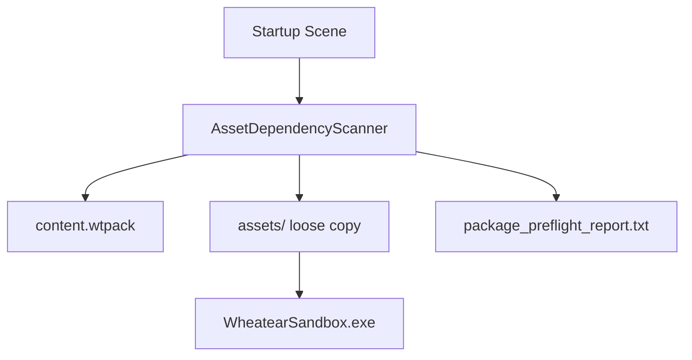

源码阅读：`WheatearEditor/src/Build/AssetDependencyScanner.cpp`、`WheatearEditor/src/Build/PlayerPackager.cpp`、`Wheatear/src/Wheatear/Assets/AssetPath.cpp`、`Wheatear/src/Wheatear/Assets/FileSystem.cpp`

### 1.3 为什么发布态零改动

发布态其实只是文件摆放方式变了，代码不需要专门分出“发布分支”。`ResolveRuntimeData()` 先找 loose 文件，找不到再回落项目根，这就是编辑态和发布态共用一套代码的根本原因。

### 1.4 构建脚本与预检

开发日常常用的脚本包括编辑器构建、Windows 全量构建和工程健康检查。打包前如果预检发现缺资产或缺场景跳转，会先写 `package_preflight_report.txt` 再停掉，不让坏包流出去。

### 1.5 全系列总结

这 16 章合起来，其实就是一条完整建造链：

```text
工程与主循环 -> 渲染 -> ECS -> 资产 -> 编辑器 -> 动画 -> 输入 -> 物理
-> VN -> WTS -> SideCombat/WAO -> 其他玩法 -> 成长 -> 素材管线 -> 打包发布
```

源码阅读：`scripts/Build-WheatearEditor.ps1`、`scripts/Build-Windows.ps1`、`WheatearEditor/src/Panels/ProjectHealthPanel.cpp`、`WheatearEditor/src/Build/PlayerPackager.cpp`

### 1.6 当前状态

- ✅ 打包闭环已跑通
- ✅ `content.wtpack` 和 loose copy 已接通运行时解析
- ✅ 预检、报告和输出目录都已经固定
